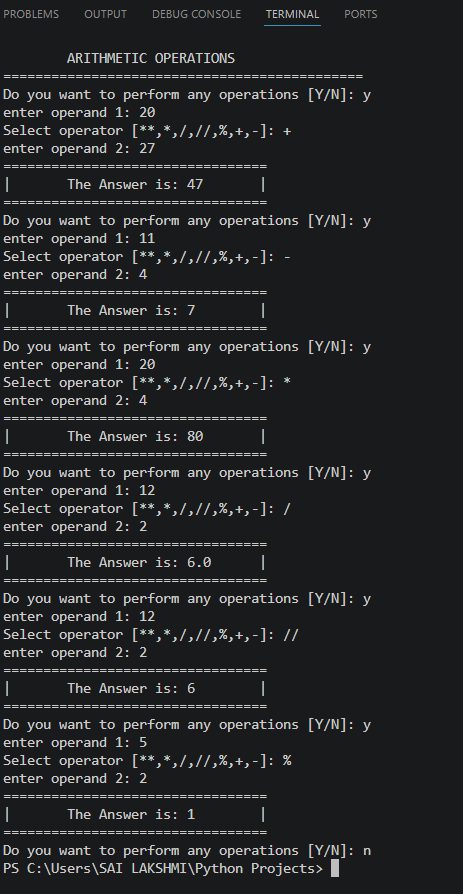

# 🧮 Python Arithmetic Calculator

A simple command-line calculator built using Python that performs basic arithmetic operations through a menu-driven interface. This project is designed for beginners to practice Python fundamentals.

---

## ✨ Features

- ➕ Addition
- ➖ Subtraction
- ✖️ Multiplication
- ➗ Division
- 🟰 Floor Division
- 📌 Modulus
- 🔢 Exponentiation
- ✅ Handles division by zero
- ✅ Validates invalid operators
- 🔄 Allows multiple calculations until the user exits

---

## 🛠️ Technologies Used

- Python 3

---

## 📚 Concepts Covered

- Functions
- Conditional Statements (`if-elif-else`)
- While Loop
- User Input
- Arithmetic Operators
- Error Handling

---

## 🚀 How to Run

1. Clone this repository.
2. Open the project in VS Code or any Python IDE.
3. Run the `Calculator.py` file.
4. Enter the first operand.
5. Select an arithmetic operator (`+`, `-`, `*`, `/`, `//`, `%`, `**`).
6. Enter the second operand.
7. View the result.
8. Continue performing calculations or enter **N** to exit.

---

## 📷 Sample Output

The calculator displays the result of the selected arithmetic operation and allows users to perform multiple calculations in a single execution.



---

## 📂 Project Structure

```text
Arithmetic-Calculator/
│── Calculator.py
│── README.md
│── LICENSE
│── .gitignore
└── Output.png
```

---

## 🎯 Learning Outcomes

Through this project, I learned:

- Writing reusable functions
- Using conditional statements (`if-elif-else`)
- Implementing loops (`while`)
- Accepting and validating user input
- Performing arithmetic operations
- Handling division-by-zero errors
- Building a menu-driven command-line application

---

## 🤝 Contributing

Contributions, suggestions, and improvements are welcome. Feel free to fork this repository and submit a pull request.

---

## 📄 License

This project is licensed under the **MIT License**.

---

## ⭐ Support

If you found this project helpful, please consider giving this repository a **⭐ Star**.
